Aufbau Hardware
===============

Dieser Abschnitt beschreibt den mechanischen und elektronischen Aufbau der
Hivora-Sense-Station. Der Aufbau besteht grob aus diesen Schritten:

1. Locktopf vorbereiten
2. Hivora Sense Aufbau
3. Software installieren (siehe :doc:`software_installation`)
4. Gerät testen (siehe :doc:`troubleshooting`)

1. Locktopf vorbereiten
-----------------------

Zunächst wird der Locktopf selbst vorbereitet. Im Prinzip kann jedes geeignete
Gefäß dazu genutzt werden. Der Hivora-Sense-Aufbau ist standardgemäß auf die
Verwendung von Urinbechern ausgelegt, so wie sie oft auch sonst verbaut werden.

Da es bereits unzählige Aufbauanleitungen im Internet gibt, gehen wir hier nicht
weiter auf den Grundaufbau ein. Eine sehr detaillierte Beschreibung zu
Locktöpfen gibt es bei der Velutina Army: https://velutina-army.de/locktopf/

Einige Aufbauten unter Verwendung von Urinbechern:

- `SWR: Locktopf basteln <https://www.swr.de/swraktuell/baden-wuerttemberg/karlsruhe/asiatische-hornisse-kampf-gegen-invasion-locktopf-basteln-100.html>`_
- `Velutina-Service: Effektive Ködermischungen <https://www.velutina-service.com/2024/09/02/effektive-koedermischungen-zur-hornissenueberwachung-dochttoepfe-in-aktion/>`_

Hier noch eine geeignete Halterung für Rohrmontage, beispielsweise für den
Balkon: https://cbrell.de/blog/vespa-velutina-locktopf-halterung/

2. Hivora Sense Aufbau
----------------------

Das Gehäuse schützt Elektronik und Kamera vor Witterung. Wichtige Punkte:

- Schutz vor Regen
- Schutz vor direkter Feuchtigkeit
- ausreichende Belüftung gegen Kondensation
- stabile Befestigung
- zugänglicher USB-C-Anschluss
- Sichtöffnung für die Kamera
- Möglichkeit zur späteren Wartung

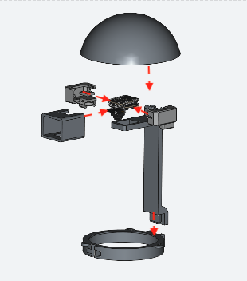

Sensor zusammenbauen
~~~~~~~~~~~~~~~~~~~~~

Zunächst muss der Sensor **Seeed Studio XIAO ESP32-S3 Sense** zusammengebaut
werden. Alle Teile müssen bereitliegen. Alle Teile bis auf die SD-Karte sind beim
Controller enthalten.

- kleine Hauptplatine mit USB-C-Anschluss
- kleine Kameraplatine
- Kühlkörper
- WiFi-Antenne
- SD-Karte (nicht enthalten beim Seeed Studio XIAO ESP32-S3 Sense)

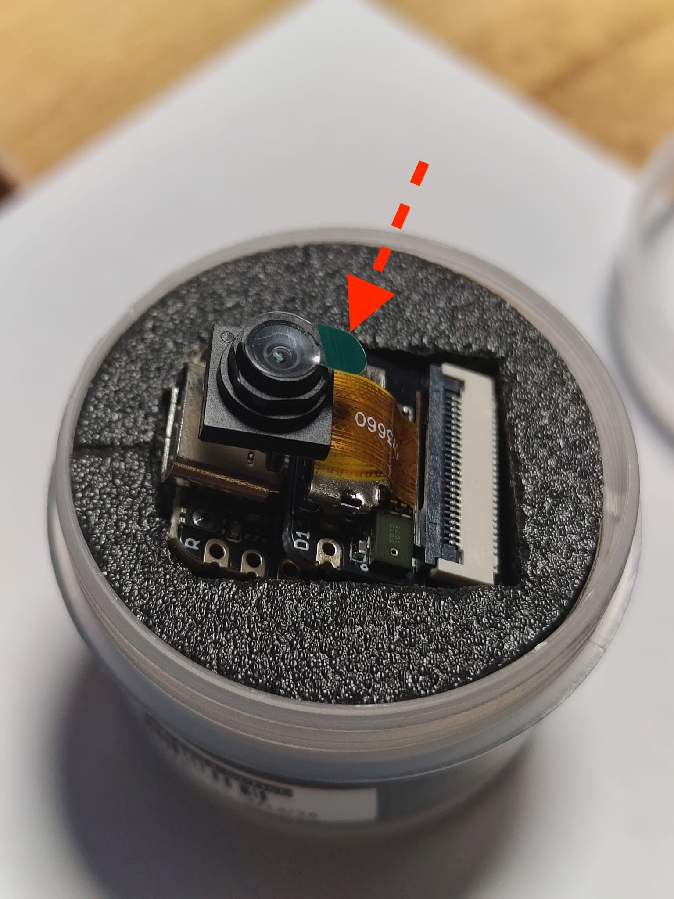

.. note::

   Im Auslieferungszustand ist auf der Linse noch eine kleine Schutzfolie, diese
   muss natürlich vorher entfernt werden.

Anschließend beginnt man damit, die WLAN-Antenne an die kleine Hauptplatine mit
USB-C-Anschluss zu stecken. Der Anschluss befindet sich an der oberen rechten
Kante der Hauptplatine (wenn die USB-C-Buchse nach unten zeigt). Mit leichtem
Druck wird die Verbindung hergestellt. Die Antenne muss eine feste Verbindung
haben.

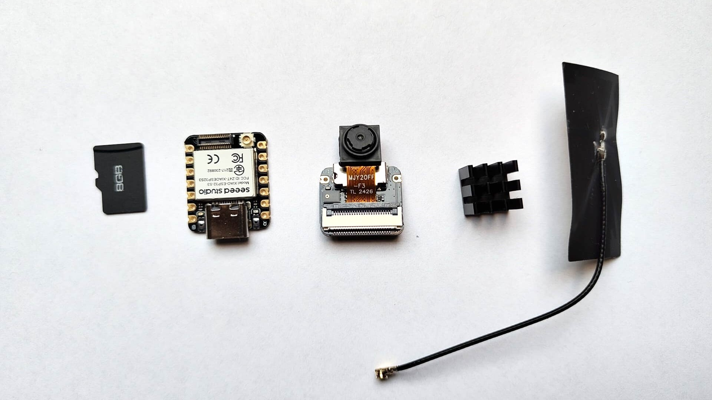

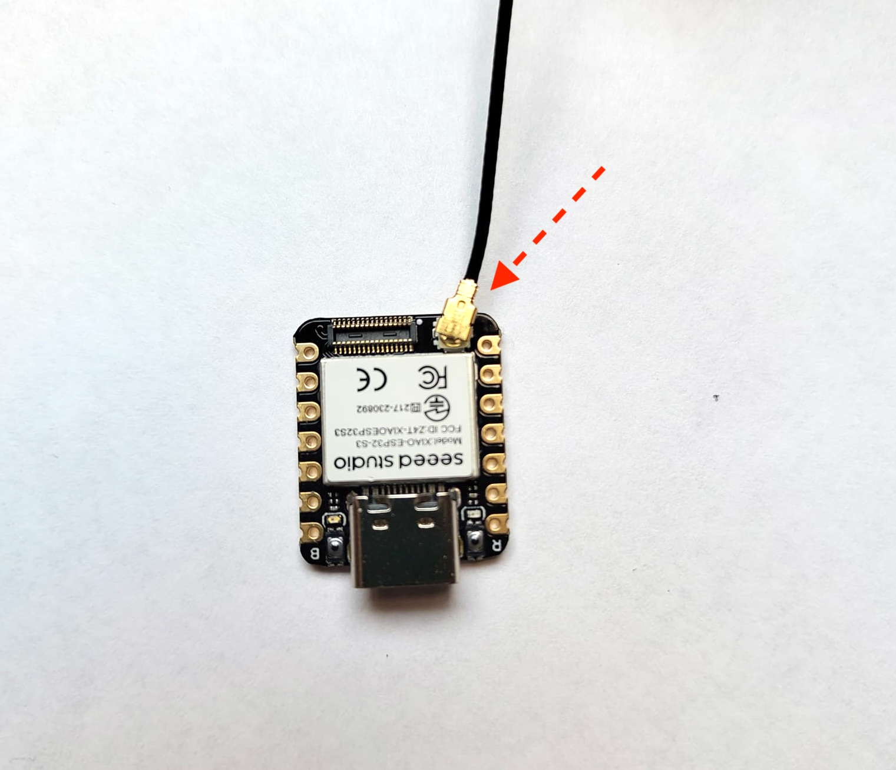

Danach werden die kleine Hauptplatine mit USB-C-Anschluss und die Kameraplatine
miteinander verbunden. Auf beiden Platinen ist dazu ein Verbinder vorgesehen.
Beide Teile werden mit sanftem Druck aufeinandergesteckt. Abschließend wird die
SD-Karte in den Slot unter dem Kameramodul geschoben. Die SD-Karte ragt dabei
aus dem Slot heraus (es handelt sich nicht um einen Slot, in welchem die
SD-Karte vollständig versenkt werden kann!).

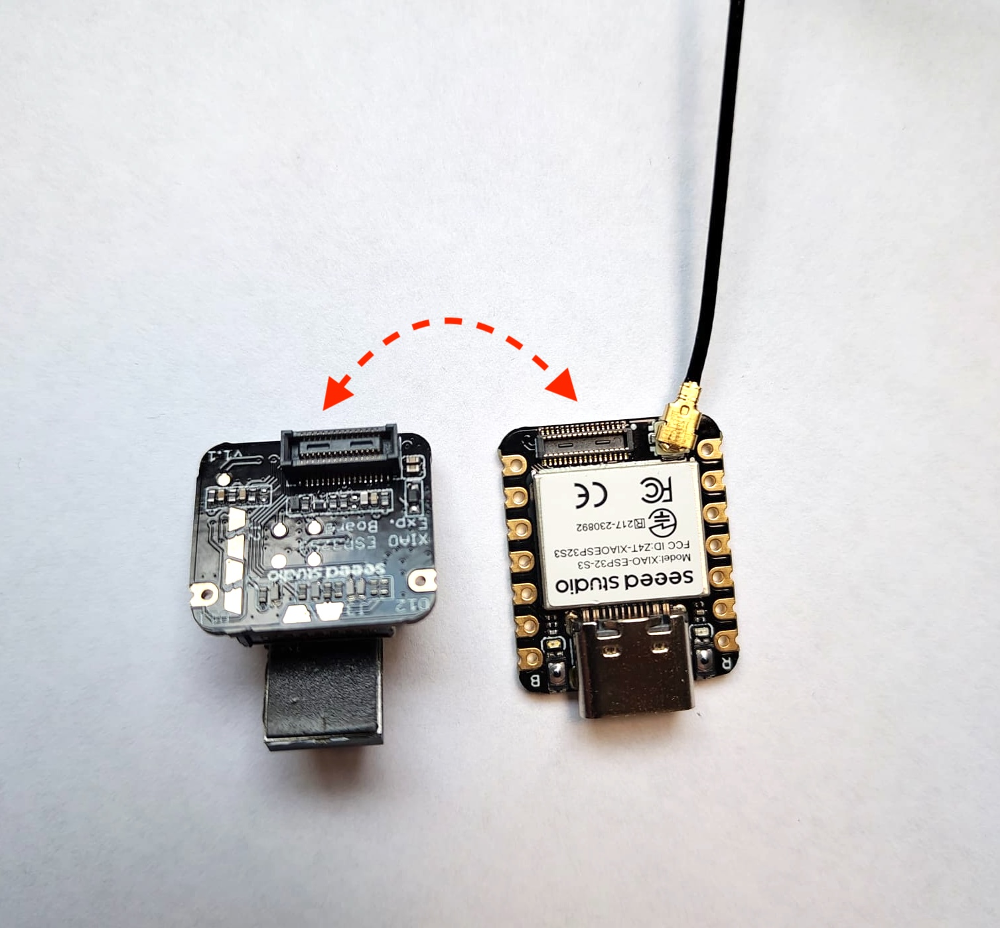

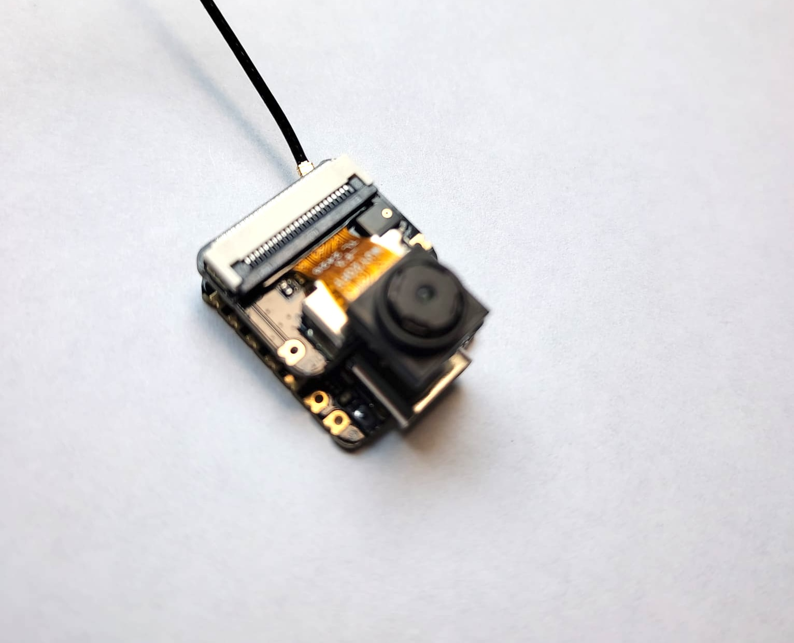

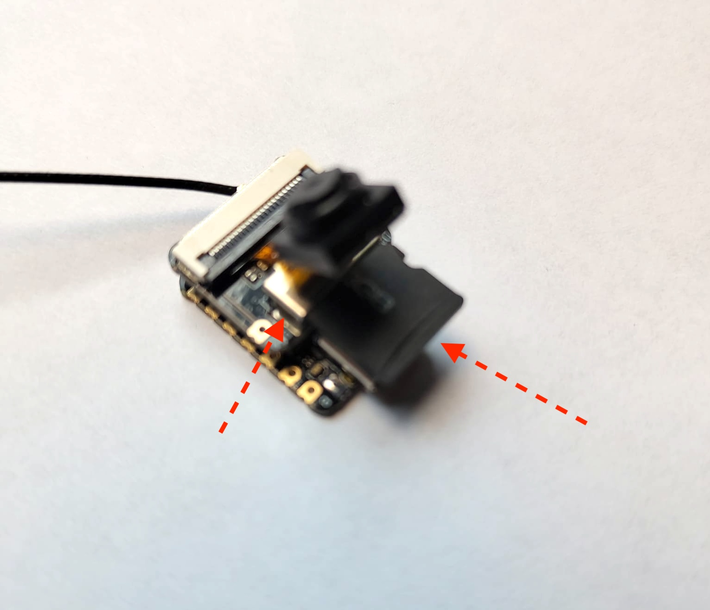

Kamera in das Gehäuse einbauen
~~~~~~~~~~~~~~~~~~~~~~~~~~~~~~~

Die Kamera wird von beiden Gehäuseteilen eingefasst. Am einfachsten funktioniert
das, indem man die Kamera in eines der beiden Gehäuseteile steckt. Dann führt man
vorsichtig das zweite Gehäuseteil zu und verklemmt mit sanftem Druck beide
Gehäuseteile miteinander. Auf der entgegengesetzten Seite des USB-C-Anschlusses
befindet sich am Gehäuse eine Durchführung für die WiFi-Antenne. Zum Schluss kann
der Kühlkörper an das Kameramodul geklebt werden. Hierzu kann die dafür
vorgesehene Öffnung im Gehäuse verwendet werden.

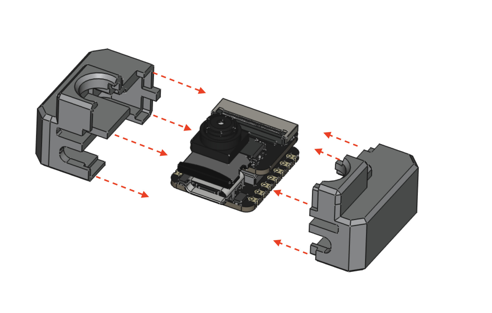

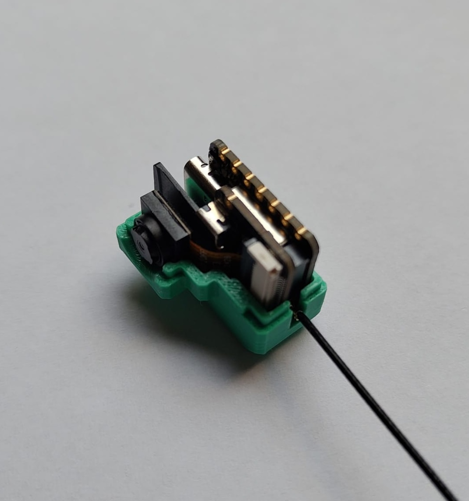

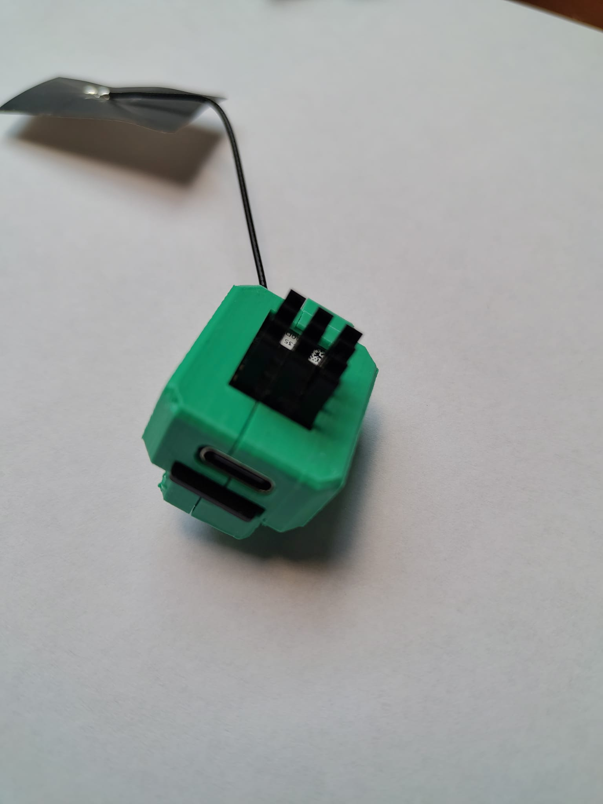

Kamera am Ständer montieren
~~~~~~~~~~~~~~~~~~~~~~~~~~~~~

Das so zusammengebaute Kameragehäuse wird nun oben in die obere Aussparung des
Ständers gedrückt. Dabei sind USB-C-Anschluss und SD-Karte nach hinten gerichtet.

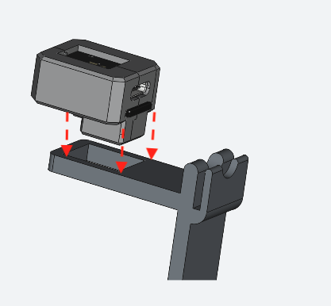

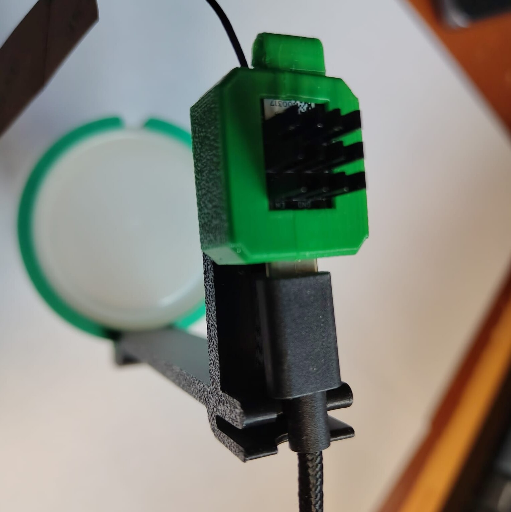

Die Kamera wird nun gegen Herausrutschen mittels des Kamera-Clips fixiert. Der
Clip wird dabei von vorne über Kamera und Stativ geschoben. Die Seite mit der
kleineren Aussparung am Clip zeigt dabei nach oben und umfasst den Kühlkörper der
Kamera. Der Ständer kann nun mit dem Locktopf-Befestigungsring verbunden werden.
Dazu wird der Ständer in die dafür vorgesehene Nut im Locktopf-Befestigungsring
geschoben.

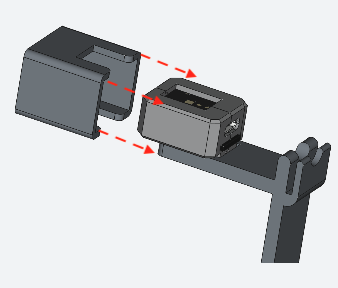

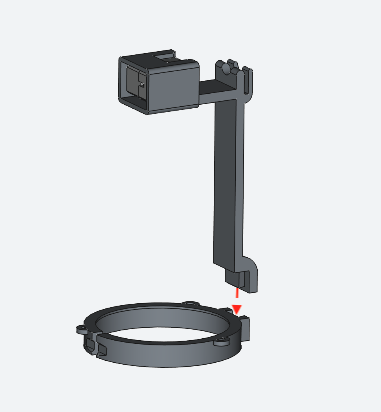

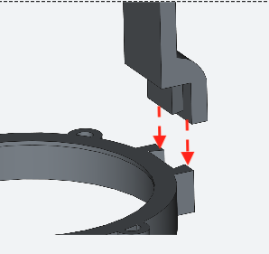

.. warning::

   Das Teil mit den Aussparungen, welches über die Kamera geschoben wird, muss
   genau um 180° gedreht werden. Die Abbildung ist hier falsch. Die Seite mit der
   längeren Aussparung muss über den Kühlkörper geschoben werden.

USB-C-Kabel verbinden und Dach anbringen
~~~~~~~~~~~~~~~~~~~~~~~~~~~~~~~~~~~~~~~~~~

Das USB-C-Kabel kann nun mit der Kamera verbunden werden. Dabei wird das Kabel
durch die „Gabelung“ nach hinten weg am Ständer geführt.

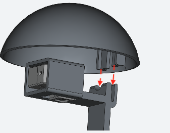

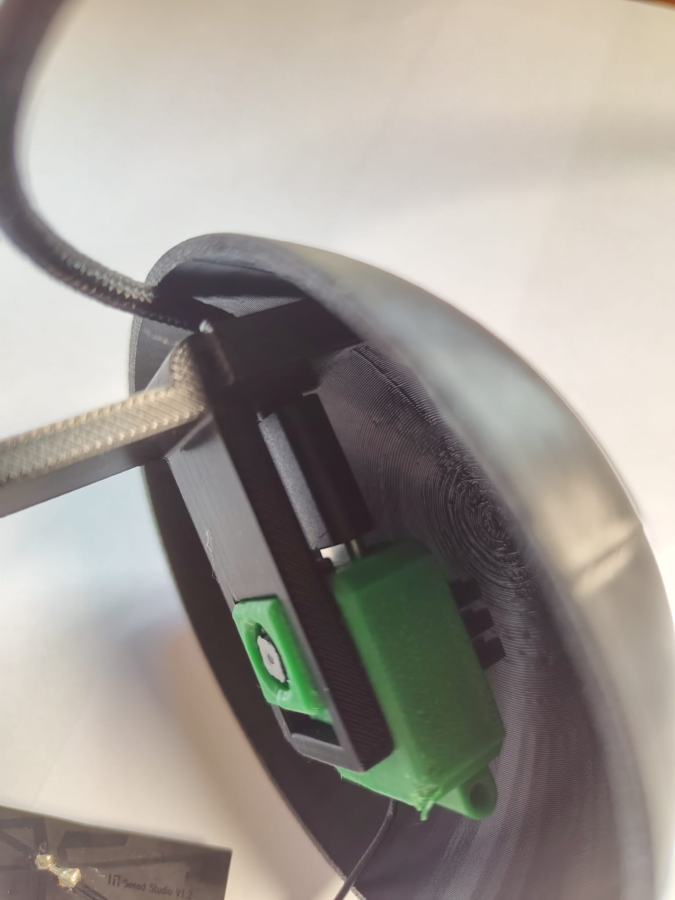

Abschließend wird das Dach angebracht. Auch hier wieder auf die
USB-C-Kabeldurchführung achten. Das Kabel kann dabei vorsichtig nach unten
entlang des Ständers gehalten werden.

Der Aufbau ist nun einsatzbereit und die Software kann installiert werden. Zur
Stromversorgung kann ein USB-C-Ladegerät verwendet werden.

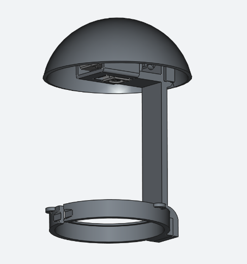

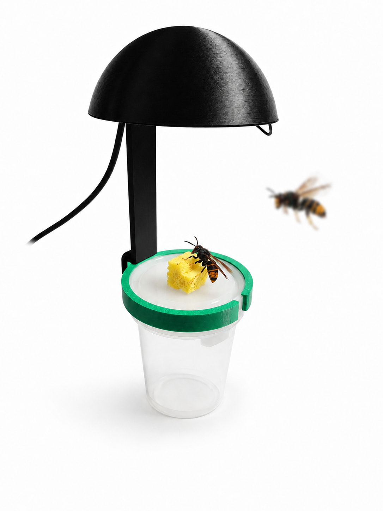
