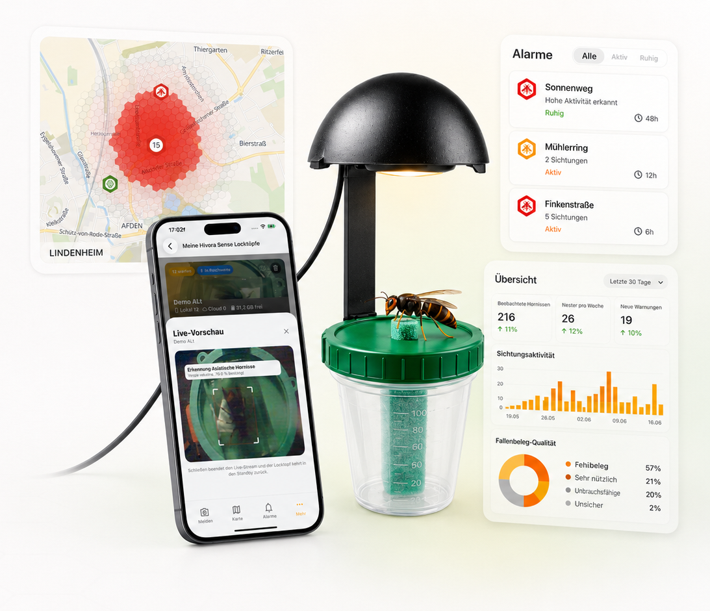

Hivora Dokumentation
====================

Willkommen zur Dokumentation von **Hivora** – dem offenen System zur
Beobachtung und Eindämmung der invasiven **Asiatischen Hornisse**
(*Vespa velutina*). Hivora besteht aus drei Bausteinen, die ineinandergreifen:

- **Hivora Sense** – der digitale Beobachtungs-Locktopf mit lokaler Edge-KI,
  der Aktivität am Locktopf rund um die Uhr erkennt.
- **HornetLog App** – die mobile App zum Melden von Sichtungen und zum
  Abholen der Aufnahmen der Locktöpfe im Feld.
- **Hivora Cloud** – die Web-Plattform auf `hivora.eu <https://hivora.eu/>`_,
  die Meldungen, Erkennungen und die Arbeit im Team zu einem gemeinsamen
  Lagebild zusammenführt.

Diese Dokumentation ist entsprechend gegliedert: **Hivora Sense** beschreibt den
Aufbau und die Inbetriebnahme der Hardware, die **HornetLog App** das Melden von
Sichtungen und den Feldeinsatz, **Hivora Cloud** die Nutzung der Web-Plattform.

.. toctree::
   :maxdepth: 2
   :caption: Hivora Cloud

   cloud_introduction
   cloud_account
   cloud_locktoepfe
   cloud_sichtungen

.. toctree::
   :maxdepth: 2
   :caption: HornetLog App

   cloud_hornetlog

.. toctree::
   :maxdepth: 2
   :caption: Hivora Sense

   introduction
   material
   hardware_setup
   software_installation
   troubleshooting
   configuration
   terminology
