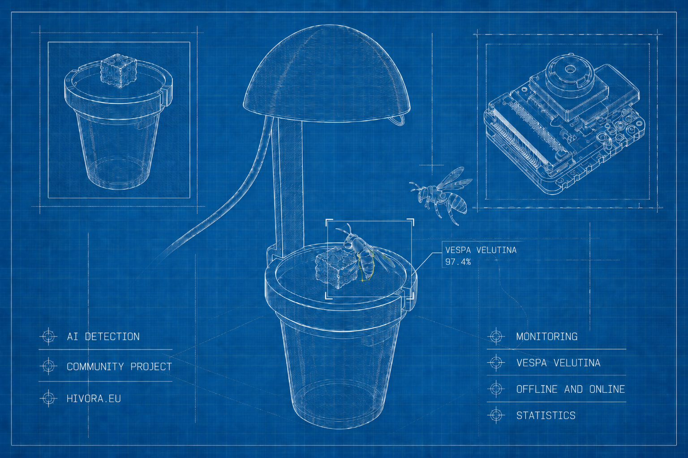

Einführung
==========

**Hivora Sense** ist ein AI-Edge-System zur Echtzeit-Erkennung von *Vespa velutina* (Asiatische Hornisse) an Wick Traps.

Das AI-Edge-Konzept bedeutet, dass die KI-Auswertung direkt am Gerät ("am Rand" des Netzwerks) stattfindet:

- Bilder und Sensordaten werden lokal verarbeitet.
- Erkennungsereignisse werden in Echtzeit erzeugt.
- Der Bedarf an permanenter Cloud-Konnektivität wird reduziert.
- Datenschutz und Reaktionsgeschwindigkeit werden verbessert.

Dieses Zusammenspiel aus lokaler Inferenz, Sensorik und optionaler Cloud-Anbindung ermöglicht ein robustes Monitoring auch in netzwerktechnisch eingeschränkten Umgebungen.

Was ist ein Locktopf und wie hilft Hivora Sense?
------------------------------------------------

Ein **Locktopf** (oft auch Dochttopf genannt) ist ein bewährtes Hilfsmittel im
Kampf gegen die invasive **Asiatische Hornisse (Vespa velutina)**. Er enthält
ein spezielles Lockmittel, das die Hornissen anzieht. Ziel ist es, die Tiere an
einer festen Futterstelle zu konditionieren, um von dort aus durch Beobachtung
der Flugrichtung ihr Nest zu finden.

**Hivora Sense** ergänzt den Locktopf um eine kleine Kamera mit
**automatischer Erkennung**. Anstatt stundenlang selbst vor dem Topf zu sitzen
und auf die Hornisse zu warten, übernimmt die Technik das für dich:

- **Automatische Erkennung:** Die Kamera schaut regelmäßig auf den Locktopf und
  erkennt via KI-Modell automatisch, ob eine Asiatische Hornisse zu sehen ist.
- **Digitale Dokumentation:** Sobald eine Asiatische Hornisse landet, wird ein
  Foto gemacht und die Sichtung mit Zeitstempel gespeichert.
- **Überwachung rund um die Uhr:** Du erfährst genau, wie oft und zu welchen
  Zeiten die Hornissen den Topf anfliegen – auch wenn du gerade nicht vor Ort
  bist.

Ziel des Aufbaus
----------------

Ein klassischer Locktopf soll mit einer kleinen elektronischen Erweiterung
ergänzt werden. Diese Erweiterung kann Beobachtungen am Locktopf dokumentieren
und perspektivisch mithilfe von Bilderkennung Hinweise auf die Asiatische
Hornisse (*Vespa velutina*) liefern.

Der Fokus liegt auf einem möglichst einfachen, nachvollziehbaren und
nachbaubaren Aufbau mit handelsüblichen Komponenten. Weil nicht jeder ein
Technik-Profi ist, wurde bewusst auf Komponenten verzichtet, die angelötet
werden müssten. Auch das Thema Stromversorgung ist noch offen; damit ist zunächst
nur ein eingeschränkter Aktionsradius möglich. In dieser einfachen Ausbaustufe
wird zudem noch kein LoRa unterstützt – dies ist jedoch geplant.

.. note::

   Diese Dokumentation basiert auf der Aufbauanleitung aus dem `Hivora Community
   Forum <https://hivora.discourse.group/t/aufbauanleitung-hivora-sense-locktopf/12>`_
   (englische Version `hier
   <https://hivora.discourse.group/t/build-guide-hivora-sense-wick-bait-station/19>`_).
   Das Projekt lebt vom Mitmachen: Verbesserungen, bessere Gehäuse, stabilere
   Stromversorgung oder andere praktische Anpassungen können und sollen in der
   Community geteilt werden. Die Anleitung ist noch nicht final und wird auf
   Basis von Praxiserfahrungen weiterentwickelt.
