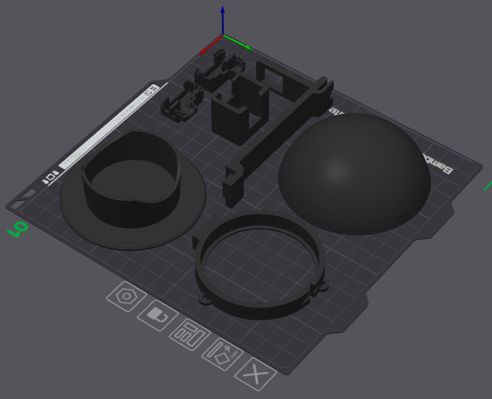

Material
========

Dieser Abschnitt listet auf, welches Material für den Aufbau eines
Hivora-Sense-Locktopfs benötigt wird und wo es bezogen werden kann. Der Fokus
liegt auf einem einfachen, nachbaubaren Aufbau mit handelsüblichen Komponenten,
die nicht angelötet werden müssen.

Benötigte Teile
---------------

Für einen einfachen Aufbau werden voraussichtlich folgende Komponenten benötigt:

.. note::

   Die angegebenen Links sind nur Beispiele. Ein Kauf bei Amazon und Seeed
   unterstützt das Projekt.

- Ein Behälter für den Locktopf (Urinbecher)

  - Apotheke
  - `Amazon.de <https://amzn.to/4uyTTnX>`_

- **Seeed Studio XIAO ESP32-S3 Sense**

  - `Seeed Studio <https://www.seeedstudio.com/XIAO-ESP32S3-Sense-p-5639.html?sensecap_affiliate=ZEBpOxG&referring_service=link>`_ – Promo Code: TURU7V1M
  - `Amazon.de <https://amzn.to/4uWFQJw>`_
  - `Reichelt <https://www.reichelt.de/de/de/shop/produkt/xiao_esp32s3_sense_wifi_bt_kamera_ov3660_ohne_header-358353>`_
  - `AliExpress <https://de.aliexpress.com/item/1005010129797593.html>`_

- USB-C-Kabel

  - `Amazon.de <https://amzn.to/4gdnuPU>`_

- Stromversorgung, zum Beispiel USB-Netzteil, Powerbank oder Solarlösung
- microSD-Karte

  - `Amazon.de <https://amzn.to/4gdnuPU>`_

- Gehäuse oder 3D-Druckteile

  - `Thingiverse <https://www.thingiverse.com/thing:7349629>`_ (kostenlos)
  - `Printables <https://www.printables.com/model/1714933-hivora-sense-ai-asian-hornet-bait-station>`_ (kostenlos)

- optional Kabelbinder oder anderes Befestigungsmaterial

.. note::

   Beim **Seeed Studio XIAO ESP32-S3 Sense** sind alle Teile (Hauptplatine,
   Kameraplatine, Kühlkörper, WiFi-Antenne) enthalten – mit Ausnahme der
   SD-Karte.

Benötigte Werkzeuge
-------------------

Je nach Aufbau können hilfreich sein:

- 3D-Drucker oder Zugriff auf gedruckte Teile
- Computer mit Internetzugang und USB-C-Anschluss oder Adapter
- Smartphone oder Laptop zum Testen der Verbindung

Kein 3D-Drucker? Kein Problem! In Deutschland gibt es unzählige Vereine, Maker
Spaces oder andere Organisationen mit Zugang zu 3D-Druckern. Solche Orte findet
man auf der Karte unter https://maker-faire.de/makerspaces/.

3D-Druck
--------

.. note::

   Für den Außeneinsatz sind Materialien wie **PETG** oder **ASA** meist besser
   geeignet als PLA. PLA kann sich bei Wärme verformen und ist langfristig
   draußen weniger robust.

Ständer und Gehäuseteile müssen mit Support gedruckt werden. Beim Dach wird ein
Brim von 5 mm empfohlen, um eine bessere Haftung am Druckbett zu erhalten.

Orientierungshilfe zum Ausrichten der Teile auf dem Druckbett des 3D-Druckers:

Die Druckdateien stehen kostenlos auf `Thingiverse
<https://www.thingiverse.com/thing:7349629>`_ und `Printables
<https://www.printables.com/model/1714933-hivora-sense-ai-asian-hornet-bait-station>`_
zur Verfügung.
