Installation Software
=====================

Die Firmware-Bereitstellung erfolgt über einen browserbasierten Cloud-Installer
mit **WebSerial** auf `hivora.eu <https://hivora.eu/>`_.

Voraussetzungen
---------------

- fertig aufgebauter Hivora Sense Locktopf-Aufsatz (siehe :doc:`hardware_setup`)
- Laptop oder anderer Computer mit Internetanschluss
- USB-Datenkabel zwischen Rechner und Kameramodul
- mindestens ein kostenloser Account bei `hivora.eu
  <https://hivora.eu/?pk_campaign=aufbauanleitung_de&pk_source=discourse&pk_medium=forum>`_

.. important::

   Es wird empfohlen, `Google Chrome <https://www.google.com/intl/de_de/chrome/>`_
   zu verwenden. Andere Chromium-basierte Browser funktionieren ebenfalls.
   Unter „Browser-Prüfung“ muss der Hinweis „Browser ist geeignet“ erscheinen.

Locktopf in hivora.eu anlegen
-----------------------------

Nach erfolgreicher Registrierung findet man auf der linken Seite im Menü den
Punkt „Meine Locktöpfe“. Dort klickt man zunächst rechts auf die Schaltfläche
„Locktopf hinzufügen“.

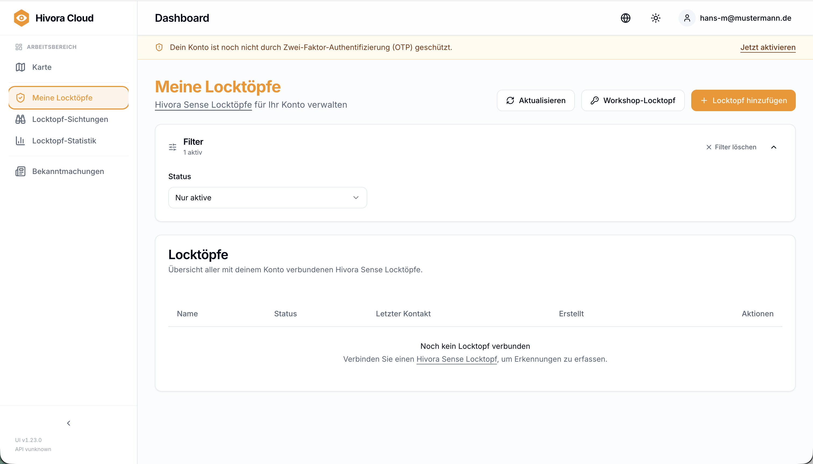

Es erscheint der Assistent zum Anlegen eines neuen Locktopfes.

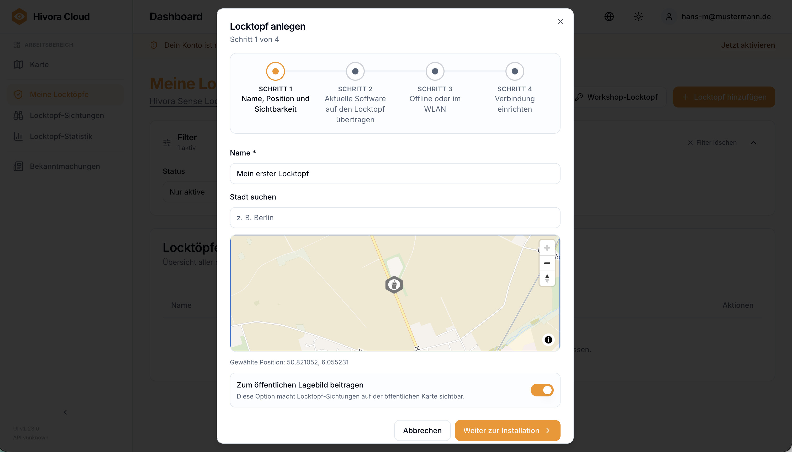

Zunächst wählt man einen Namen. Dieser dient später nur zur Wiedererkennung des
Locktopfes in der Übersichtsliste. In der Karte wählt man den Standort des
Locktopfes.

.. note::

   Der Standort ist wichtig, wenn man später zu den öffentlichen
   Sichtungsmeldungen beitragen möchte und wenn man in Kombination die
   `hornet-log.app <https://hornet-log.app>`_ Mobile App nutzen möchte, um
   Alarmierungen seines eigenen Locktopfes zu erhalten. Die Position des
   Locktopfs wird bei Verwendung der App jedes Mal bei einer Synchronisation mit
   der App aktualisiert und an den aktuellen Standort angepasst.

Unten schaltet man noch ein, dass man zum öffentlichen Lagebild beitragen möchte
(optional, aber sehr hilfreich für die Community). Den Schritt schließt man ab,
indem man mittels der Schaltfläche „Installieren“ die Software auf das Gerät
überträgt.

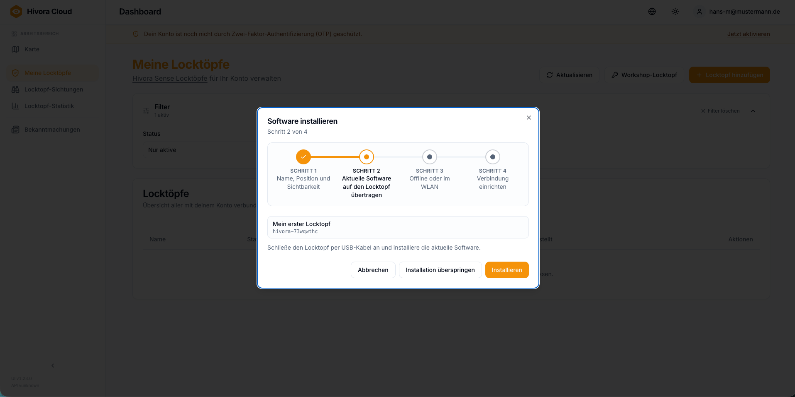

Firmware installieren
---------------------

In Schritt 2 wird die Software (Firmware) auf den Seeed XIAO ESP32-S3 Sense
(Kameramodul) installiert. Hierzu klickt man einfach auf die Schaltfläche
„Installieren“.

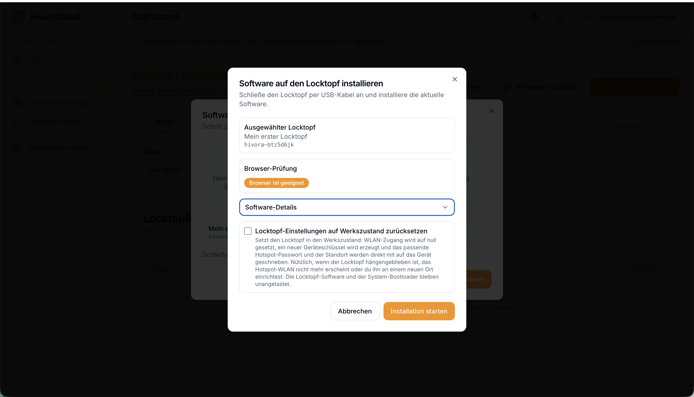

Es öffnet sich ein weiterer Dialog, welcher Details zur Software anzeigt. Im Feld
Umgebungsprüfung wird angezeigt, ob der verwendete Browser die USB-Anbindung
unterstützt. Das orangene Label mit der Beschriftung „Umgebung unterstützt“
bedeutet, dass man fortfahren kann, indem man auf „Installation starten“ klickt.

.. note::

   Mittels „Locktopf komplett zurücksetzen“ werden vorherige
   Software-Installationen auf der Platine vor der Installation wieder gelöscht.
   Dies beinhaltet auch alle Pins, Namen etc. Daten, welche sich bereits auf der
   SD-Karte befinden, bleiben unberührt.

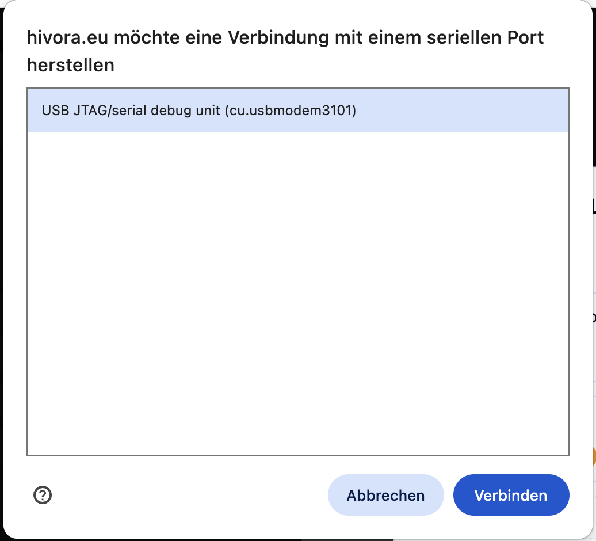

Es öffnet sich ein Browserfenster, das anzeigt, dass die Webseite Zugriff auf den
USB-Anschluss anfordert. Wählen Sie in dem angezeigten Kasten die USB-Verbindung
des Controllers aus. In der Regel ist dies, wie im Bild zu sehen, ein Eintrag wie
„usbmodem3101“.

.. note::

   Wenn hier mehrere Geräte aufgelistet werden, sollten alle anderen USB-Geräte
   vom Computer getrennt werden. Danach sollte nur noch das Kameramodul übrig
   bleiben.

Anschließend klicken Sie auf „Verbinden“. Die Übertragung der Software beginnt,
und die Software wird auf dem Kameramodul installiert. Dieser Vorgang kann einen
Moment dauern.

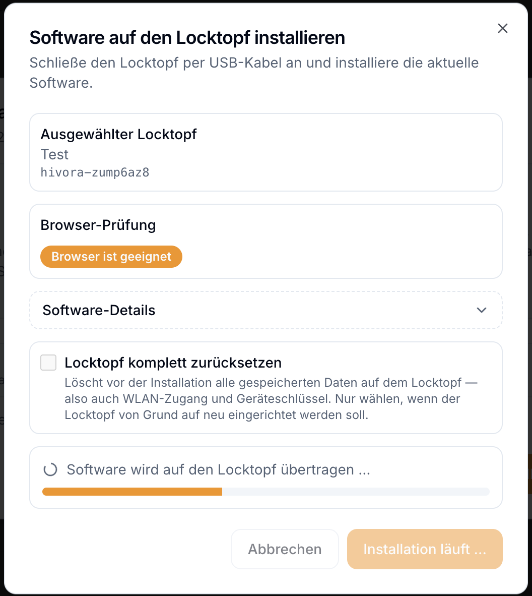

Nach der Installation kann das Fenster über die Schaltfläche „Schließen“
geschlossen werden.

Anschließend muss das Kameramodul einmal vom Strom getrennt werden. Ziehen Sie
dazu den USB-C-Stecker aus dem Computer. Nach ein paar Sekunden kann der Stecker
wieder eingesteckt werden. Das Kameramodul startet nun neu und lädt die eben
übertragene Software.

Betriebsmodus wählen
--------------------

In Schritt 3 wird festgelegt, wie der Locktopf betrieben werden soll: entweder im
Offline-Betrieb, also an einem Standort ohne aktive Internetverbindung, oder im
lokalen WLAN, zum Beispiel zu Hause im Garten.

.. note::

   Für den Offline-Betrieb kann die App `hornet-log.app
   <https://hornet-log.app>`_ verwendet werden. Diese ermöglicht die
   Synchronisation des Locktopfs.

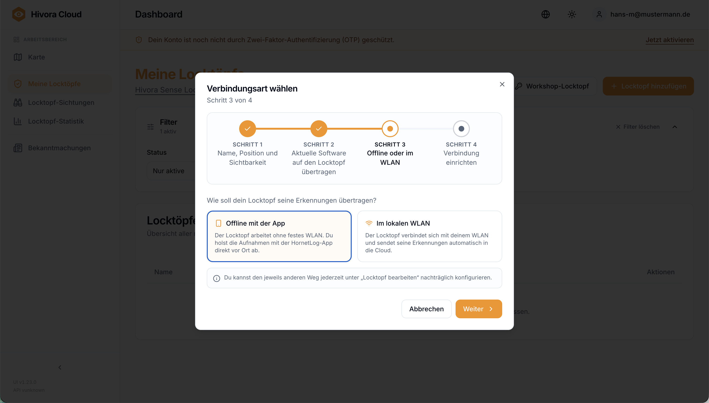

Man wählt also „Offline mit der App“ und klickt weiter.

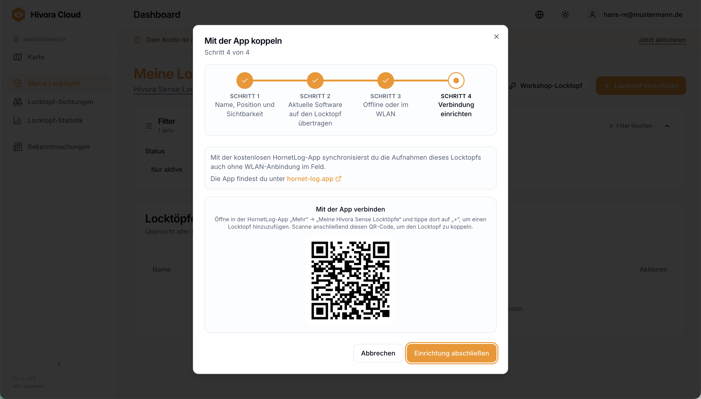

Dieser Schritt wird zunächst offen gelassen. Bevor die Einrichtung abgeschlossen
werden kann, muss zunächst mit der Installation der App fortgefahren werden.

Offline mit der HornetLog App
-----------------------------

.. important::

   Für die folgenden Schritte ist die HornetLog App in Version 1.3.0
   erforderlich. Ältere Versionen unterstützen Locktöpfe noch nicht. Bei
   Installationen ab dem 26.06.2026 ist Version 1.3.0 bereits installiert.

Installieren Sie nun die App auf Ihrem Smartphone. Sie finden die App unter dem
Namen „HornetLog“ im Apple App Store und bei Google Play. Am schnellsten geht es,
indem Sie den passenden QR-Code mit der Kamera Ihres Smartphones scannen:

.. raw:: html

   

     

       
Apple (iPhone/iPad)

       

         
         
       

     

     

       
Android

       

         
         
       

     

   

Nachdem die App installiert und geöffnet wurde, wechseln Sie in der unteren
Navigationsleiste in den Bereich „Mehr“.

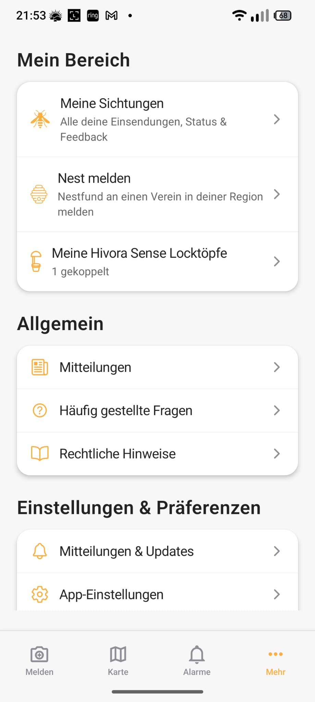

Dort finden Sie den Punkt „Meine Hivora Sense Locktöpfe“. Wählen Sie diesen Punkt
aus. Die App wechselt nun zur Übersichtsseite der Locktöpfe.

Über das „+“-Icon unten rechts kann ein neuer Locktopf hinzugefügt werden. Nach
dem Tippen auf „+“ erscheint eine Seite, auf der entweder der QR-Code gescannt
oder die Geräte-ID und PIN direkt eingegeben werden können.

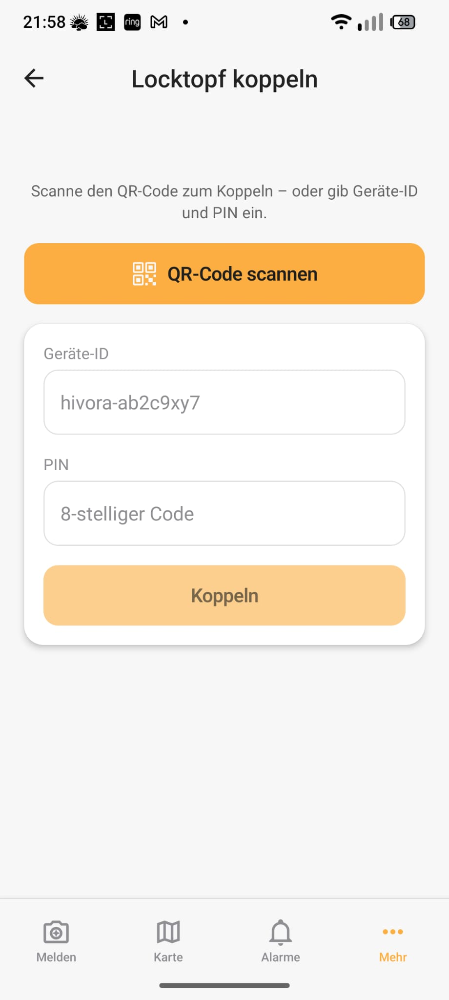

Besonders unkompliziert und ohne Tippfehler geht es über den QR-Code weiter.
Tippen Sie dazu auf „QR-Code scannen“. Anschließend wird die Kamera des
Smartphones geöffnet.

Nun muss im noch geöffneten Dialog im hivora.eu-Account der QR-Code mit der App
gescannt werden. Anschließend erscheint der Locktopf automatisch in der Liste der
Locktöpfe in der App.

Sollten Sie bereits voreilig auf „Einrichtung abschließen“ geklickt haben, können
Sie den Dialog mit dem QR-Code jederzeit über das Stift-Symbol wieder öffnen.

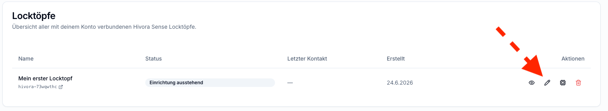

Ab jetzt kann man den Locktopf jederzeit über die App synchronisieren.

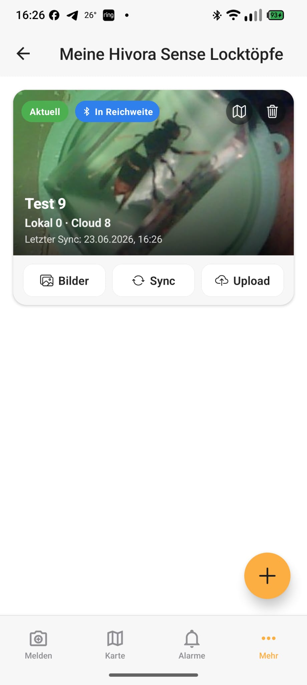

Zum Synchronisieren tippen Sie auf die Schaltfläche „Sync“. Dabei werden folgende
Daten synchronisiert:

- alle Bilder von der SD-Karte des Locktopfs in die App
- die Uhrzeit des Smartphones zum Locktopf
- der Standort des Smartphones zum Locktopf

Falls auf dem Smartphone eine Internetverbindung besteht, werden die Bilder
anschließend in die Cloud synchronisiert. Dort können später jederzeit die
eigenen Statistiken angesehen werden.

.. note::

   Die Verbindung zum Locktopf wird über Bluetooth hergestellt. Sie müssen sich
   daher in unmittelbarer Nähe zum Locktopf befinden. Ein blaues Banner in der
   Locktopf-Kachel zeigt an, welcher Locktopf aktuell in Reichweite ist.

Fortgeschritten: Offline ohne App bzw. mit aktiver WLAN-Anbindung
-----------------------------------------------------------------

Das Kameramodul öffnet bei jedem Start automatisch ein eigenes kleines WLAN. Das
gilt zum Beispiel, wenn der Strom getrennt und anschließend wieder verbunden
wird. Dieses WLAN trägt den Namen des Locktopfs.

Um die erweiterten Einstellungen zu erreichen, folgen Sie einfach den Schritten
im Abschnitt „Im lokalen WLAN“.

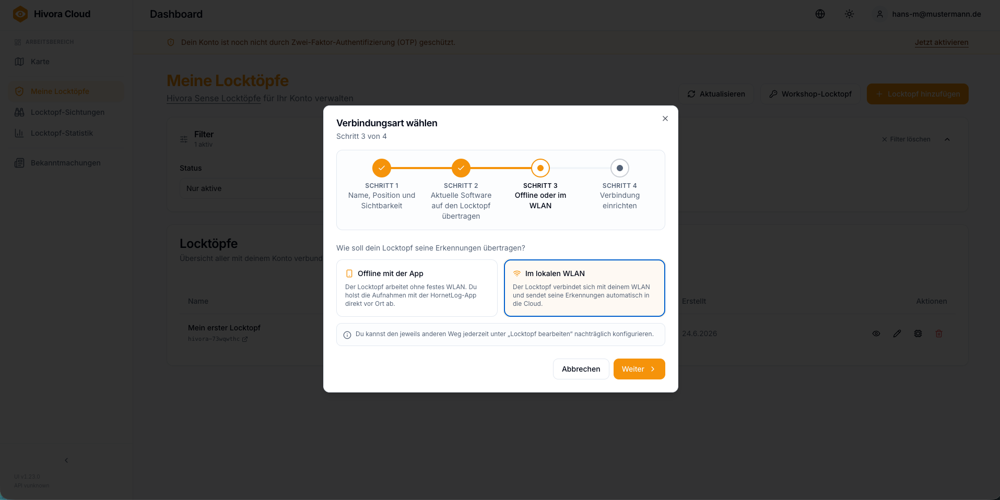

Sollten Sie sich zuvor anders entschieden haben, können Sie die Anleitung zur
Einrichtung jederzeit über das kleine Stift-Symbol erneut aufrufen. Dort findet
man die Anweisungen unter „WLAN-Betrieb“.

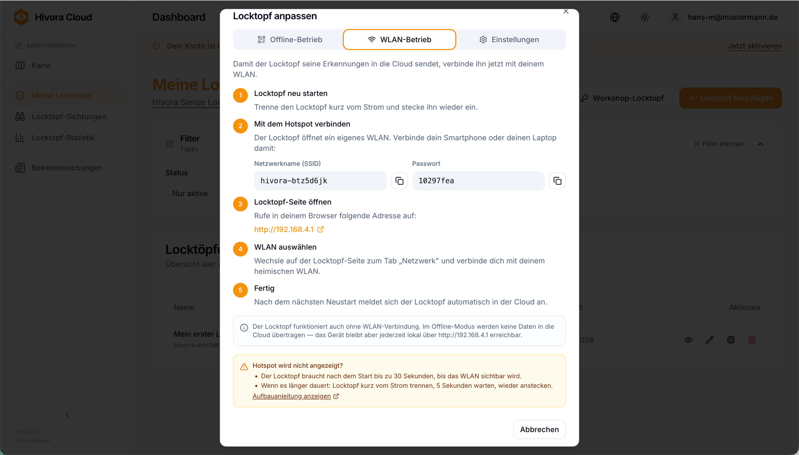

**Hivora Sense Web-Frontend des Kameramoduls**

Die Weboberfläche startet automatisch in der Galerie. Diese ist zu Beginn noch
leer.

Für den Offline-Betrieb ist die Konfiguration an dieser Stelle abgeschlossen. Ab
sofort steht der smarte Locktopf zur Verfügung.

Wenn Sie die Sichtungen des Locktopfs im Betrieb ohne Internetverbindung
kontrollieren möchten, müssen Sie sich in der Nähe des Locktopfs, zum Beispiel mit
einem Smartphone, mit dem WLAN des Kameramoduls verbinden. Die Bilder können
anschließend über den Download-Button heruntergeladen werden.

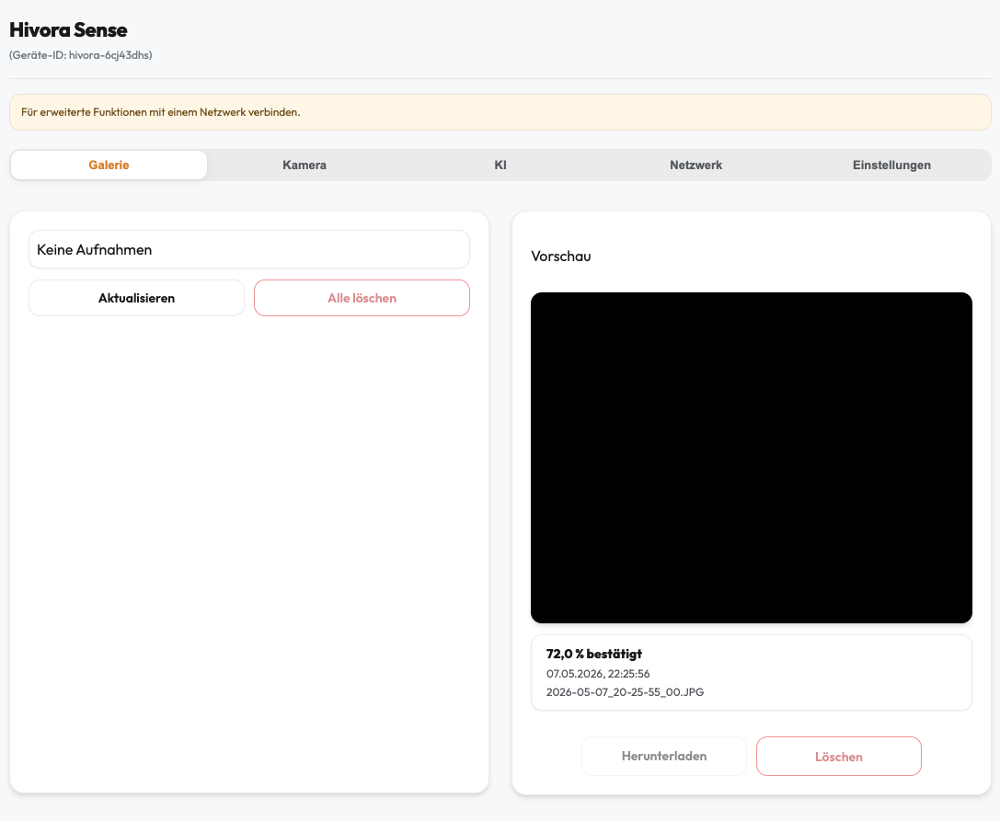

Mehr Komfort bietet die Verbindung mit einem WLAN mit Internetzugang. In diesem
Fall werden Sichtungen an die Online-Plattform hivora.eu übertragen und können
dort detaillierter ausgewertet werden.

Dadurch sind später auch Benachrichtigungen in der HornetLog App möglich.
Voraussetzung dafür ist, dass öffentliche Sichtungen aktiviert wurden und in der
App eine Alarmierungszone am Standort des Locktopfs eingerichtet wurde.

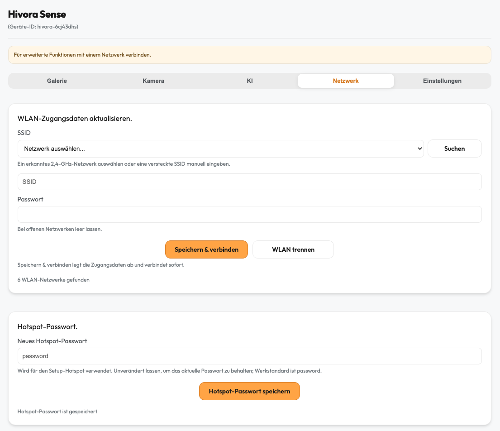

Zum Verbinden mit dem heimischen WLAN wählen Sie aus der Liste einfach das
gewünschte WLAN aus und geben das dazugehörige Passwort ein.

Nach dem Speichern wird das Hivora Sense Kameramodul neu gestartet. Anschließend
sollte auch der verwendete Computer wieder mit dem regulären WLAN mit
Internetzugang verbunden werden.

Sichtungen erscheinen fortan automatisch in der Liste der Sichtungen.

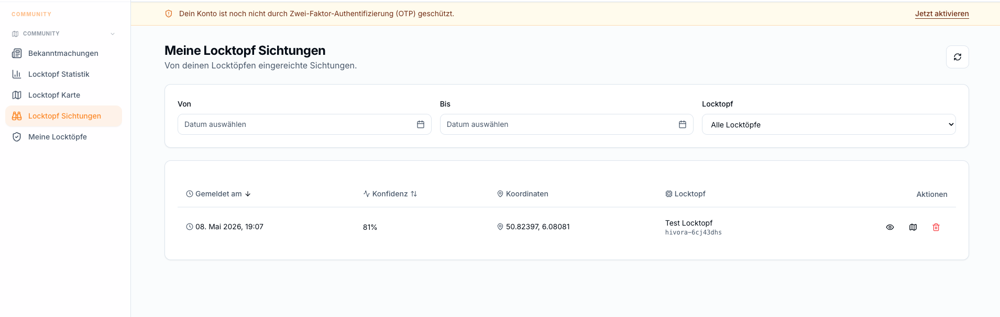

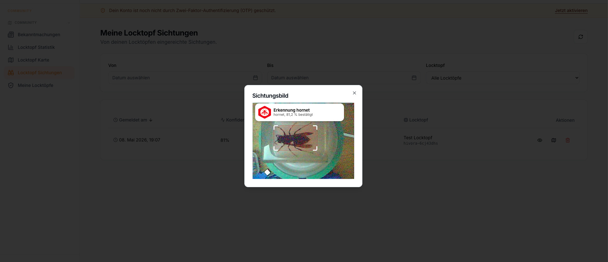

Die Einrichtung ist nun vollständig abgeschlossen und der Locktopf ist
vollumfänglich einsatzbereit.

Update Software
---------------

Ein Software-Update aktualisiert die Firmware auf dem Gerät auf eine neuere
Version. Der Ablauf entspricht der Erstinstallation über den Cloud-Installer:

1. Gerät per USB verbinden und einschalten.
2. Cloud-Installer im Browser öffnen und über WebSerial verbinden.
3. Die neue Firmware-Version auswählen und den Flash-Vorgang starten.
4. Abschlussmeldung abwarten und Gerät neu starten.
5. Nach dem Neustart die installierte Version und die Basisfunktion prüfen.

.. note::

   Vor einem Update sollten bestehende Konfigurationen (z. B. Netzwerk- und
   Kalibrierungswerte) gesichert werden, falls diese beim Flash-Vorgang
   zurückgesetzt werden.

Ausführlichere Hinweise finden sich im Abschnitt :doc:`troubleshooting`.
